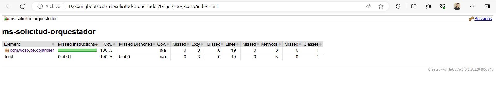

### Microservicio: Solicitud de Prestamo - Orquestador
Este servicio se encarga de validar los datos de la solicitud de prestamo y enviar al servicio de dominio para que se guarde.

### Dependencias

* Java 17

#### Iniciar proyecto
* Ingresar al proyecto
* Abrir terminal
* Ejecutar el comando `./mvnw spring-boot:run`

#### Reporte de pruebas unitarias con jacoco
* Ingresar al proyecto
* Abrir terminal
* Ejecutar el comando: `./mvnw test` en la raíz del proyecto
* Esto creará dentro del proyecto un reporte en la siguiente dirección: `/target/site/jacoco/index.html`
* Abrir `index.html` en el navegador
* Por último vera algo como esto:

